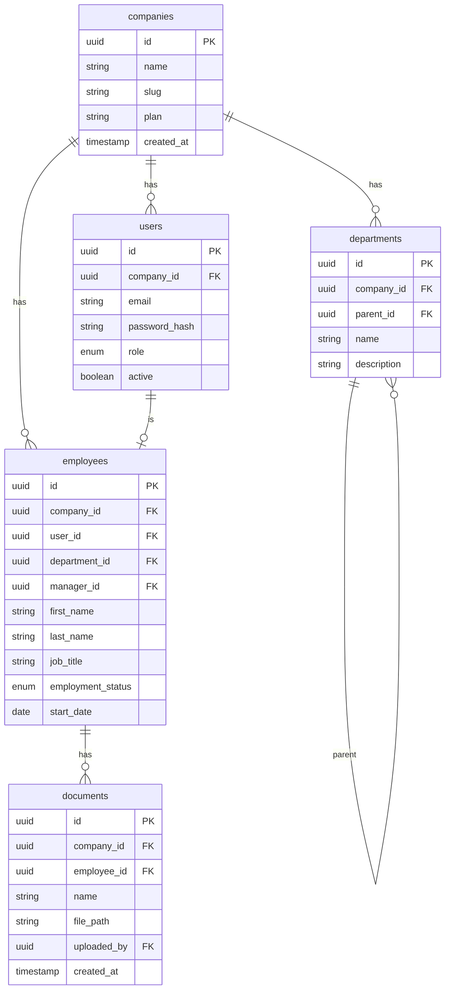
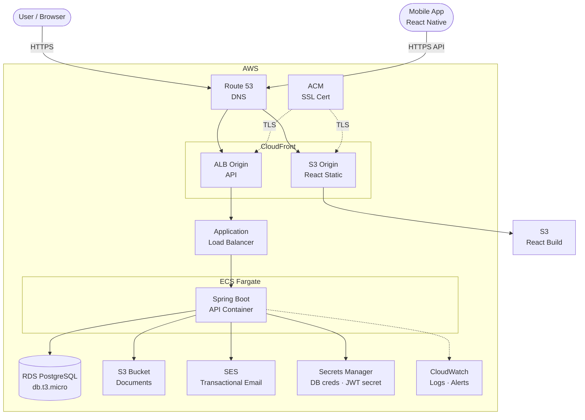

# I'm Building a Full SaaS HR Platform Solo — Here's the Full Story, from Messy Idea to Working Code

*How AI helped me go from vague ambition → structured requirements → architecture decisions → 75 user stories → 3 phases of working software*

---

## The Ambition

I set out to build a modern HR SaaS platform — think SageHR, but greenfield, UK-market-first, targeting everything from 10-person startups to enterprise. Full employee lifecycle: onboarding, leave management, attendance, mobile app, payroll, performance reviews, ATS. The whole thing.

Solo developer. No team. No VC. No deadlines except the ones I set myself.

The question wasn't *whether* it was possible — it was how to do it without losing my mind or cutting corners that would collapse under real usage.

Here's what it looks like today — dashboard with real seeded data, fully running in Docker:

<!-- IMAGE: docs/screenshots/03-dashboard.png -->
> *The HR dashboard — employee stats, recent hires, attendance clock-in, full navigation.*

---

## It Started Messy

Let me be honest about how this actually began.

The first sessions were chaotic. I had an idea — "build an HR platform" — but that's not a plan. I knew I wanted something modern, something opinionated, something better than the legacy tools. But when I sat down to actually start, I hit the usual wall: *where do you even begin?*

What kind of companies are we targeting? How big? What features for launch, what's deferred? UK-specific compliance or generic? Shared database or separate schemas per tenant? What does "done" even mean for a feature?

These aren't questions you answer by typing code. I spent the first phase just talking through the product — using Claude AI as a thinking partner to stress-test ideas and surface decisions I hadn't realised I needed to make.

> *What happens when an employee is deactivated — do pending leave requests auto-reject?*
> *If you're UK-first, you need regional public holiday calendars from day one — England, Wales, Scotland, and Northern Ireland are different.*
> *Custom fields tables are a trap. Every mature HR platform regrets them. Model real domain columns instead.*

Iteration after iteration of this kind of conversation turned vague intent into concrete, defensible decisions.

---

## Requirements First: Getting the Foundation Right

After several rounds of discussion, something useful emerged: not code, but a structured requirements picture.

The core product questions became answered:
- **Market**: SMB to Enterprise, UK-first
- **Pricing model**: per employee/month — Starter, Growth, Enterprise tiers
- **Multi-tenancy approach**: shared database, shared schema, `company_id` on every table — no per-tenant schema management complexity
- **Launch features vs. deferred**: what ships in Phase 1 vs. what waits for Phase 4, 5, 6, 7

Then came the architecture decisions — each one a discussion, not a coin flip:

- **Spring Boot 4 on Java 25** — newest LTS, built on Spring Framework 7. Not the "safe" choice, the *right* choice for a platform that needs to last.
- **React 19** on web, **React Native 0.79** on mobile — one React codebase, not two separate teams of knowledge
- **PostgreSQL 17** — the multi-tenancy story works cleanly here
- **Terraform** managing all AWS infra — `terraform apply` spins everything up, `terraform destroy` tears it all down
- **Docker Compose** for local dev — zero AWS spend until staging is ready

And the non-negotiable engineering rules that emerged:
- JWT auth with refresh tokens, Spring Security abstracted so OAuth2/SSO drops in later without touching business logic
- Flyway for every DB migration — never touch the database manually
- Soft deletes for employees — `employment_status = TERMINATED`, never hard delete
- Documents always via S3 pre-signed URLs (15-minute expiry) — never serve S3 directly
- No custom fields tables — model real domain columns

These aren't opinions. Each one came from a concrete reason, surfaced in discussion before it became a bug in production.

---

## From Requirements to a Roadmap

With the product and architecture defined, the next step was structure: what does "the whole thing" actually look like as deliverable work?

This is where the chaos really got resolved. Together, we mapped out the full product across **7 phases and 75 user stories**.

| Phase | Focus |
|---|---|
| **Phase 1** | Foundation — auth, employee management, documents, dashboard |
| **Phase 2** | Leave & Attendance — leave types, approval workflows, clock-in/out |
| **Phase 3** | Mobile App — React Native, push notifications |
| **Phase 4** | Performance Reviews — OKRs, 360 feedback, review cycles |
| **Phase 5** | Recruitment / ATS — job postings, candidate pipeline, offer letters |
| **Phase 6** | UK Payroll — PAYE, NI, HMRC RTI, payslips, BACS, P60s |
| **Phase 7** | Integrations — public API, SSO, accounting exports, GDPR tools |

Every story became a [GitHub issue](https://github.com/laxminarayanaboga/project_hr/issues) with acceptance criteria, subtasks, and test requirements. Every phase became a [GitHub Milestone](https://github.com/laxminarayanaboga/project_hr/milestones).

The planning artefact — the single file that captured all of this — became what I called `CLAUDE.md`. It's checked into the repo root. It contains every architectural decision, every engineering rule, the full phased roadmap, and the story execution playbook. It's what I read when I'm unsure what to do at 11pm. It's also what Claude reads at the start of every session — so there's no re-explaining context, no relitigating decisions already made, no starting cold.

That document is as much a product of this project as the code.

---

## The Development Workflow: Story-Driven, One at a Time

With the foundation in place, development followed a strict workflow — for every one of the 75 stories:

1. Branch from main: `issue/{n}/{short-description}`
2. Build in order: migration → entity → service → controller → frontend → tests → E2E
3. Every story ships with unit tests (JUnit 5 + Mockito, MockMvc, Vitest) and Playwright E2E specs
4. PR raised, human reviews, merges — then move to the next story

No partial stories. No "we'll write tests later." No "it works on my machine."

The hardest discipline: if tests fail on a clean `docker compose down -v && docker compose build --no-cache`, the story isn't done. A passing test on a stale Docker volume is *not* a passing test. That rule caught real bugs — Flyway migrations that worked against an existing schema but failed on a fresh install. Exactly what would have broken on first staging deploy.

---

## Phase 1: Foundation — 18 Stories, Fully Done

> [Milestone: Phase 1](https://github.com/laxminarayanaboga/project_hr/milestone/1) — Weeks 1–12

### Auth

<!-- IMAGE: docs/screenshots/01-login.png -->
> *Login page — JWT auth, refresh tokens, password reset. Spring Security abstracted for OAuth2/SSO drop-in later.*

([#5](https://github.com/laxminarayanaboga/project_hr/issues/5), [#6](https://github.com/laxminarayanaboga/project_hr/issues/6), [#7](https://github.com/laxminarayanaboga/project_hr/issues/7), [#8](https://github.com/laxminarayanaboga/project_hr/issues/8)): Company registration creates a company record and an HR_ADMIN user in one transaction, returns a JWT pair. Login, refresh tokens, logout, password reset with email tokens — all built, all tested. Spring Security abstracted from day one so OAuth2/SSO can drop in later without touching business logic.

**Multi-tenancy**: Every query goes through a Spring interceptor that injects `company_id`. Developers can't accidentally leak one company's data to another — it's structural, not a code convention.

### Data Model

The core schema underpins everything. Here's how the Phase 1 tables relate:

> *Render this at [mermaid.live](https://mermaid.live) to see the ER diagram. Every table carries `company_id` — multi-tenancy is structural.*

### Departments & Employees

<!-- IMAGE: docs/screenshots/05-org-chart.png -->
> *Org chart — recursive department tree using `parent_id`. Clicking any department opens management view.*

([#10](https://github.com/laxminarayanaboga/project_hr/issues/10), [#11](https://github.com/laxminarayanaboga/project_hr/issues/11)): Recursive tree using `parent_id`, exposed as a nested org chart. The tricky part was building a clean tree endpoint that didn't result in N+1 queries.

<!-- IMAGE: docs/screenshots/04-employees.png -->
> *Employee list — search, filter by status, employee numbers auto-assigned, department and role visible at a glance.*

([#12](https://github.com/laxminarayanaboga/project_hr/issues/12), [#13](https://github.com/laxminarayanaboga/project_hr/issues/13), [#14](https://github.com/laxminarayanaboga/project_hr/issues/14), [#15](https://github.com/laxminarayanaboga/project_hr/issues/15)): Full profile — personal info, employment details, manager relationship, department assignment. Soft deletes only: `employment_status = TERMINATED`. Never hard delete an employee record.

**Documents** ([#16](https://github.com/laxminarayanaboga/project_hr/issues/16), [#17](https://github.com/laxminarayanaboga/project_hr/issues/17)): Upload to S3, generate pre-signed URLs for download (15-minute expiry). Local dev uses a filesystem service with HMAC-signed tokens that behaves identically to the S3 service — swap at staging with a Spring profile change.

**Dashboard** ([#18](https://github.com/laxminarayanaboga/project_hr/issues/18)): RBAC-driven stats. Employees see their own data. Managers see their team. HR Admins see everything.

By the end of Phase 1: 153 backend unit tests, 67 frontend component tests, Playwright API specs covering every endpoint.

---

## Phase 2: Leave & Attendance — The Complex One

> [Milestone: Phase 2](https://github.com/laxminarayanaboga/project_hr/milestone/2) — 11 stories

This is where most HR platforms hide their complexity, and it showed.

<!-- IMAGE: docs/screenshots/06-leave.png -->
> *Leave management — request leave, view status, team calendar. Multi-level approval workflows underneath.*

**Leave types** ([#19](https://github.com/laxminarayanaboga/project_hr/issues/19)) are fully configurable — annual, sick, maternity/paternity, unpaid, custom. Each has its own accrual rules and approval requirements.

**Approval workflows** ([#21](https://github.com/laxminarayanaboga/project_hr/issues/21), [#22](https://github.com/laxminarayanaboga/project_hr/issues/22)) support multi-level chains: employee → manager → HR admin. The state machine for a leave request (PENDING → APPROVED/REJECTED, with the ability to cancel pending requests) needed careful thought to avoid race conditions when two approvers act simultaneously.

**Leave balance tracking** ([#23](https://github.com/laxminarayanaboga/project_hr/issues/23)) does rolling accruals — not just "you get 25 days on January 1st." Entitlement accrues monthly, carries over with a configurable cap, and is adjusted for part-time employees by FTE ratio.

**UK public holidays** ([#24](https://github.com/laxminarayanaboga/project_hr/issues/24)) ship as a pre-seeded calendar for England, Wales, Scotland, and Northern Ireland — because they're different, and getting this wrong means employees in Scotland think they have a holiday they don't.

<!-- IMAGE: docs/screenshots/07-attendance.png -->
> *Attendance — clock-in/out with a single button. Overtime flagging and team dashboard for managers.*

**Clock-in/clock-out** ([#25](https://github.com/laxminarayanaboga/project_hr/issues/25), [#26](https://github.com/laxminarayanaboga/project_hr/issues/26)) with overtime tracking: the system detects when you've exceeded contracted hours and flags it. Managers see a team dashboard ([#28](https://github.com/laxminarayanaboga/project_hr/issues/28)). Everything exports to CSV ([#27](https://github.com/laxminarayanaboga/project_hr/issues/27)).

**Leave email alerts** ([#29](https://github.com/laxminarayanaboga/project_hr/issues/29)) use Thymeleaf templates. Local dev logs to console. Production flips to SES via Spring profiles — zero code change, just config.

---

## Phase 3: Mobile App — React Native

> [Milestone: Phase 3](https://github.com/laxminarayanaboga/project_hr/milestone/3) — 6 stories shipped

The mobile app gets you to about 90% of the feature set that matters day-to-day:

- Secure login with JWT stored in the device keychain — not AsyncStorage ([#31](https://github.com/laxminarayanaboga/project_hr/issues/31))
- Employee directory with search ([#32](https://github.com/laxminarayanaboga/project_hr/issues/32))
- Leave request submission and approval flows ([#33](https://github.com/laxminarayanaboga/project_hr/issues/33))
- Attendance clock-in/out ([#34](https://github.com/laxminarayanaboga/project_hr/issues/34))
- Push notifications for approvals and alerts ([#35](https://github.com/laxminarayanaboga/project_hr/issues/35))

React Native 0.79 with Expo-style tooling but bare workflow — more control when you need to integrate with native device APIs. The biggest challenge was environment configuration: React Native requires dotenv values to be baked in at build time, not runtime, which catches out developers coming from web backgrounds.

Two things deferred intentionally: payslip viewing ([#36](https://github.com/laxminarayanaboga/project_hr/issues/36) — needs the Phase 6 payroll engine to exist first) and App Store / Play Store submission ([#37](https://github.com/laxminarayanaboga/project_hr/issues/37) — needs developer accounts, moved to Phase 7).

---

## What's Next: Staging Deploy

> [Milestone: Phase 3b](https://github.com/laxminarayanaboga/project_hr/milestone/8) — 7 stories

Phases 1–3 are done. The app works end-to-end in Docker. Now it's time to make it real.

### AWS Architecture

> *Render at [mermaid.live](https://mermaid.live). `terraform apply` spins the entire thing up from scratch.*

Phase 3b wires it all together:
- Full Terraform: RDS, ECS Fargate, S3, CloudFront, ALB, Secrets Manager ([#95](https://github.com/laxminarayanaboga/project_hr/issues/95))
- GitHub Actions CI/CD activated — they've been skeletons until now, no point burning build minutes before staging exists ([#96](https://github.com/laxminarayanaboga/project_hr/issues/96))
- SES wired for transactional email ([#97](https://github.com/laxminarayanaboga/project_hr/issues/97))
- S3 wired for employee document storage ([#98](https://github.com/laxminarayanaboga/project_hr/issues/98))
- Custom domain + SSL via Route 53 + ACM ([#99](https://github.com/laxminarayanaboga/project_hr/issues/99))
- CloudWatch monitoring and alerting ([#100](https://github.com/laxminarayanaboga/project_hr/issues/100))
- Playwright smoke tests running against the live staging URL ([#101](https://github.com/laxminarayanaboga/project_hr/issues/101))

The Terraform is mostly written. The infrastructure modules — networking, ECS, RDS, CDN, secrets — are all [in the repo](https://github.com/laxminarayanaboga/project_hr/tree/main/infrastructure). It's the wiring-up phase.

---

## The Honest Take on AI-Assisted Development

I've used [Claude Code](https://claude.ai/code) throughout this build — but the important thing is *how*.

It wasn't a code generator I pointed at tasks. It was involved from the very beginning: the requirements discussions, the architecture decisions, the roadmap breakdown. The messy early phase where I was figuring out what I was even building — that happened in collaboration with AI, not before I brought it in.

The distinction between a code generator and an engineering partner matters:

- A **code generator** produces code when you describe a feature.
- An **engineering partner** asks clarifying questions, catches problems before they become bugs, maintains consistency across 75 stories and thousands of lines of code, and remembers that a decision made in Story 5 has implications for Story 45.

The key was writing the `CLAUDE.md` playbook — explicit rules about how stories get executed, what "done" means, when to ask questions and when to just make the call. That playbook is as much a product of this project as the code. And it emerged from the same requirement-shaping conversations that produced the roadmap.

**Things that worked:**
- Spend time on requirements and architecture *before* feature 1. Every decision you defer becomes a disruption mid-build.
- Non-negotiable test standards. No story ships without full test coverage. No exceptions, no "we'll add tests later."
- Clean Docker builds for E2E. Never trust a test that ran against a volume with accumulated state.
- One story at a time. Batching stories introduces coordination complexity that kills velocity.

**What I'd do differently:**
- Set up the staging deploy earlier — probably after Phase 1. Running real infra sooner would have surfaced environment-specific issues before they stacked up.

---

## Where It's Going

The roadmap after staging — tracked on [GitHub Milestones](https://github.com/laxminarayanaboga/project_hr/milestones):

- **[Phase 4](https://github.com/laxminarayanaboga/project_hr/milestone/4)**: Performance reviews — review cycles, OKRs, 360-degree feedback, customizable templates
- **[Phase 5](https://github.com/laxminarayanaboga/project_hr/milestone/5)**: Recruitment / ATS — job postings, candidate pipeline, offer letters, candidate-to-employee conversion
- **[Phase 6](https://github.com/laxminarayanaboga/project_hr/milestone/6)**: UK Payroll — PAYE, NI, HMRC RTI submission, payslips, BACS export, P60s
- **[Phase 7](https://github.com/laxminarayanaboga/project_hr/milestone/7)**: Integrations — public API, Google Workspace SSO, Xero/QuickBooks export, GDPR tools

That's about 8 months of build ahead. The foundation is solid enough that each phase is additive, not a rewrite.

---

## The Code

The repo is public at [github.com/laxminarayanaboga/project_hr](https://github.com/laxminarayanaboga/project_hr) — the architecture patterns, `CLAUDE.md` playbook, and Terraform modules are all there to read. More posts as phases complete.

Building in public from here. More posts as the staging deploy lands and Phase 4 starts.

---

*Solo developer building UK HR SaaS. Spring Boot 4, React, React Native, AWS, Terraform. 75 stories. One at a time.*

---

## Images checklist (before publishing to Medium)

Upload these images to Medium and replace the `<!-- IMAGE: ... -->` comments above:

| Slot | File | Caption |
|---|---|---|
| After intro | `docs/screenshots/03-dashboard.png` | HR dashboard — employee stats, attendance, recent hires |
| Auth section | `docs/screenshots/01-login.png` | Login — JWT auth with refresh tokens |
| Org chart | `docs/screenshots/05-org-chart.png` | Department org chart — recursive tree |
| Employee list | `docs/screenshots/04-employees.png` | Employee directory — search, filter, status |
| Leave section | `docs/screenshots/06-leave.png` | Leave management — request, approve, balances |
| Attendance section | `docs/screenshots/07-attendance.png` | Attendance — clock-in/out, overtime tracking |
| Data model | Render `erDiagram` block at mermaid.live | ER diagram — Phase 1 schema |
| AWS architecture | Render `graph TB` block at mermaid.live | AWS infra — CloudFront, ECS, RDS, S3 |
